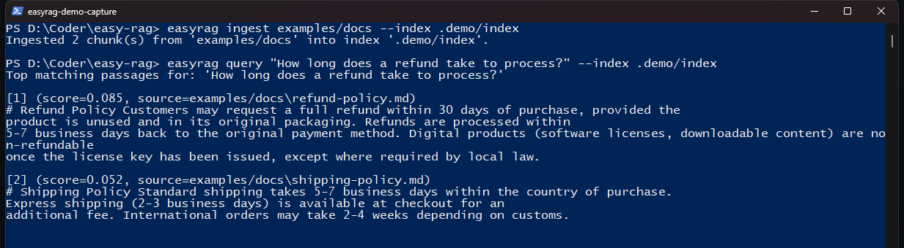

# easy-rag

Build a working Retrieval-Augmented-Generation (RAG) pipeline from a folder
of documents in a few lines of code — or one CLI command. No API key
required to get started.




## What is RAG, in plain terms?

A language model like Claude or GPT only knows what it was trained on — it
has never seen your PDFs, your company's internal docs, or last week's
meeting notes. **Retrieval-Augmented Generation (RAG)** fixes this by:

1. **Retrieving** the most relevant passages from your own documents for a
   given question (using a search technique called embedding similarity,
   explained below), then
2. **Feeding those passages to a language model** as context, so it answers
   using your actual documents instead of guessing from its training data.

This is how most "chat with your documents" or "AI search over your
knowledge base" products work under the hood. Building one from scratch
normally means wiring together four separate pieces yourself: a document
loader, a text chunker, an embedding model, and a vector database. **easy-rag
does all four for you.**

### The three concepts you need to know

- **Chunking** — documents are split into smaller passages (a few hundred
  words each) because embedding models and language models both work better
  on short, focused pieces of text than on a 50-page PDF at once.
- **Embeddings** — each chunk is converted into a list of numbers (a vector)
  that captures its meaning. Chunks about similar topics end up with similar
  vectors, which is what makes semantic search possible.
- **Vector store** — a database of these vectors that can quickly find the
  ones most similar to a question's vector, i.e. the passages most relevant
  to what was asked.

## How this tool works

```
   documents/          Pipeline.ingest()                  Pipeline.query()
  ┌──────────┐    ┌──────────────────────┐            ┌───────────────────┐
  │ text/md  │    │ 1. load              │            │ 1. embed question │
  │ csv      │ →  │ 2. chunk             │  →  index  │ 2. search index   │
  │ pdf/docx │    │ 3. embed             │            │ 3. generate answer│
  │ images   │    │ 4. store in index    │            └───────────────────┘
  └──────────┘    └──────────────────────┘
```

Every stage is swappable. The defaults need **zero setup and zero API
keys** — a built-in hashing-based embedder and an in-memory vector store —
so you can try the whole pipeline the moment you install it. When you're
ready for better answer quality, swap in real embedding models or Claude/
OpenAI generation by changing one argument.

| Stage      | Default (zero setup)        | Upgrade options |
|------------|------------------------------|------------------|
| Embedder   | `hashing` (numpy only)        | `local` (sentence-transformers), `openai`, `gemini` (Google), `llamacpp` (local GGUF model) |
| Vector store | `numpy` (in-memory, brute-force) | `faiss` (approximate nearest neighbor, for larger corpora) |
| Generator  | `none` (returns matched passages, no LLM call) | `anthropic` (Claude), `openai` (GPT), `gemini` (Google), `llamacpp` (local GGUF model) |

`llamacpp` and `openai` (pointed at a local server) are two different ways
to run a fully local, free model with no API key — see [Running a local LLM
with llama.cpp](#running-a-local-llm-with-llamacpp) below. `anthropic`,
`openai`, and `gemini` are the three major hosted API providers; switching
between them (or between any of the five generator/embedder choices) is a
one-argument change, since every provider implements the same small
interface (see [Architecture](#architecture)).

### Supported file types

| Type | Extensions | Extra needed |
|------|-----------|--------------|
| Plain text / Markdown | `.txt`, `.md`, `.markdown`, `.rst` | none |
| Spreadsheets | `.csv` | none |
| PDF | `.pdf` | `pip install easy-rag[pdf]` |
| Word documents | `.docx` | `pip install easy-rag[docx]` |
| Images (via OCR) | `.png`, `.jpg`, `.jpeg`, `.bmp`, `.tiff` | `pip install easy-rag[ocr]` (also needs the [Tesseract OCR engine](https://github.com/tesseract-ocr/tesseract) installed on your system) |

Mixing file types in the same folder is fine — `ingest()` picks the right
loader per file automatically and skips anything it doesn't recognize.

#### Higher-quality PDF extraction with opendataloader-pdf

The default PDF reader (`pypdf`) does a flat text dump — fine for simple
documents, but it can scramble reading order on multi-column layouts, tables,
and complex forms. [opendataloader-pdf](https://github.com/opendataloader-project/opendataloader-pdf)
is an alternative backend that preserves reading order and document
structure, at the cost of a heavier dependency: it wraps a JVM-based parser,
so it needs **Java 11+ installed on your system** in addition to the Python
package.

```bash
pip install easy-rag[opendataloader]
```

```python
pipeline = Pipeline(pdf_backend="opendataloader")
```

```bash
easyrag ingest ./my_documents --pdf-backend opendataloader
```

If Java isn't found, this raises a clear error telling you to install it (or
switch back to `pdf_backend="pypdf"`) rather than silently misbehaving.
Internally, PDFs are batched into as few JVM invocations as possible for
speed, while still converting files one at a time whenever that's needed for
correctness -- a single invalid PDF, or two different PDFs that happen to
share the same filename in different folders, are both handled without
losing or corrupting any other file's content.

## Installation

```bash
pip install -e .                 # core: .txt / .md / .csv (numpy only)
pip install -e ".[pdf]"          # + PDF support
pip install -e ".[opendataloader]" # + higher-quality PDF extraction (also needs Java 11+)
pip install -e ".[docx]"         # + Word document support
pip install -e ".[ocr]"          # + image support (also needs Tesseract OCR installed)
pip install -e ".[local]"        # + real local embeddings (sentence-transformers, faiss)
pip install -e ".[anthropic]"    # + Claude generation
pip install -e ".[openai]"       # + OpenAI embeddings/generation (or any OpenAI-compatible local server)
pip install -e ".[gemini]"       # + Google Gemini embeddings/generation
pip install -e ".[llamacpp]"     # + fully local GGUF models, in-process, no server (see below)
pip install -e ".[all]"          # everything
```

## Quickstart

### As a library

```python
from easy_rag import Pipeline

pipeline = Pipeline()                       # zero-setup defaults
pipeline.ingest("./my_documents")            # load, chunk, embed, index
answer = pipeline.query("What is the refund policy?")
print(answer)
```

Run the included example (uses the sample docs in `examples/docs`):

```bash
python examples/quickstart.py
```

### As a CLI

```bash
easyrag ingest ./my_documents --index .easyrag/index
easyrag query "What is the refund policy?" --index .easyrag/index
```

## Adding your own documents ("training" the pipeline on your data)

There is an important thing to understand up front: **RAG does not train or
fine-tune a model.** The language model itself never changes. "Teaching" the
pipeline about your documents just means indexing them so they can be
searched — a process called **ingestion**, not training. This is why it is
fast (seconds to minutes, not hours) and why you can add new documents at
any time without retraining anything.

Here is the whole process, end to end:

1. **Put your files in a folder.** Any mix of `.txt`, `.md`, `.csv`, `.pdf`,
   `.docx`, or images — subfolders are searched too.
2. **Ingest that folder** — this is the "training" step, and it is one line:
   ```bash
   easyrag ingest ./my_documents --index .easyrag/index
   ```
   Under the hood this loads each file, splits it into chunks, converts each
   chunk into a vector, and saves everything to `.easyrag/index`.
3. **Query it** — also one line:
   ```bash
   easyrag query "your question here" --index .easyrag/index
   ```
4. **Adding more documents later?** Ingest the new folder into the same
   `--index` path. Ingestion is *incremental*: it fingerprints every file by
   modification time and size, so a second `ingest` run only processes files
   that are new or changed — everything else is skipped, and a changed file's
   old chunks are automatically replaced rather than left behind as stale
   duplicates.
5. **Need to force a full re-ingest anyway** (e.g. after changing
   `--chunk-size`)? Add `--force` to reprocess every file regardless of the
   manifest: `easyrag ingest ./my_documents --index .easyrag/index --force`.

That's the entire loop. There is no separate training run, no GPU required
for the default setup, and no waiting — the example in this repo indexes and
becomes queryable in well under a second.

## Registering source folders, and auto-ingesting dropped files

Typing out a folder path every time gets old, and sometimes you just want new
files to show up in the index automatically. Both are built in.

### Pick which folders the index should ingest

```bash
easyrag sources add ./my_documents --index .easyrag/index
easyrag sources add ./another_folder --index .easyrag/index
easyrag sources list --index .easyrag/index
```

Once registered, `easyrag ingest` with no path ingests every registered
folder:

```bash
easyrag ingest --index .easyrag/index
```

Remove a folder from the list with `easyrag sources remove <folder> --index
.easyrag/index`. This only stops future ingestion from that folder — it
doesn't delete chunks already ingested from it.

### Auto-ingest files as they're dropped in

```bash
easyrag watch --index .easyrag/index --interval 5
```

This checks every registered source folder every 5 seconds (configurable)
and ingests anything new or changed — so dropping a file into a watched
folder gets it added to the index within one interval, with no command to
re-run. Stop it with Ctrl+C. The same incremental fingerprinting from
`ingest` applies, so already-processed files are never reprocessed.

The same is available as a library, if you want to drive the watch loop
yourself (e.g. from inside another application):

```python
import os

from easy_rag import Pipeline
from easy_rag.sources import add_source, load_sources
from easy_rag.watcher import watch

index_path = ".easyrag/index"
add_source(index_path, "./my_documents")
pipeline = Pipeline.load(index_path) if os.path.exists(index_path + ".config.json") else Pipeline()
watch(pipeline, load_sources(index_path), index_path, interval=5)
```

### Upgrading to real embeddings and a hosted LLM

Claude, OpenAI, and Gemini are supported as drop-in alternatives — swap the
`llm=`/`embedder=` argument, nothing else changes:

```python
pipeline = Pipeline(embedder="local", vectorstore="faiss", llm="anthropic")   # Claude
pipeline = Pipeline(embedder="openai", vectorstore="faiss", llm="openai")      # OpenAI
pipeline = Pipeline(embedder="gemini", vectorstore="faiss", llm="gemini")      # Google Gemini
```

```bash
easyrag ingest ./my_documents --embedder local --vectorstore faiss
easyrag query "What is the refund policy?" --llm anthropic
easyrag query "What is the refund policy?" --llm openai --model gpt-4o-mini
easyrag query "What is the refund policy?" --llm gemini --model gemini-2.5-flash
```

Each provider reads its API key from the standard environment variable:
`ANTHROPIC_API_KEY` (Claude), `OPENAI_API_KEY` (OpenAI), `GEMINI_API_KEY`
(Google). Model names shown are sensible current defaults, not the only
option — pass `--model` (CLI) or `model=` (`llm_kwargs`/`embedder_kwargs`)
to use whichever model your account has access to; all three providers
release new models faster than any hardcoded default can track, so check
each provider's current model list if a default ever stops working.

The `openai` and `gemini` embedders send requests in batches (default 100
texts per request, override with `batch_size=`) rather than one giant
request for an entire `ingest()` call, and retry a failed batch a few times
with exponential backoff before giving up — so a large ingest survives a
provider's per-request size limit and rides out a transient rate-limit or
network error instead of aborting on the first hiccup.

## Running a local LLM with llama.cpp

If you want generation (or embeddings) fully local and free — no API key,
no per-token cost, no data leaving your machine — [llama.cpp](https://github.com/ggml-org/llama.cpp)
is the standard way to run open models (Llama, Qwen, Mistral, and others) in
the `GGUF` file format on ordinary CPUs, with optional GPU acceleration.
There are two ways to use it here; pick whichever installs more easily on
your machine.

### Option A: in-process, one Python package (recommended to try first)

```bash
pip install easy-rag[llamacpp]
```

```python
from easy_rag import Pipeline

# No model_path needed -- the first time this runs, it downloads and caches
# a small instruction-tuned model from Hugging Face Hub automatically.
pipeline = Pipeline(embedder="llamacpp", llm="llamacpp")
pipeline.ingest("./my_documents")
print(pipeline.query("What is the refund policy?"))
```

```bash
easyrag ingest ./my_documents --embedder llamacpp
easyrag query "What is the refund policy?" --llm llamacpp
```

The defaults download `Qwen2.5-0.5B-Instruct-GGUF` (generation, ~400 MB) and
`Qwen3-Embedding-0.6B-GGUF` (embeddings, ~400 MB) the first time each is
used, cached by `huggingface-hub` afterward — check you have the bandwidth
and disk space before relying on this in a constrained environment. To use
a model you've already downloaded instead, point at the file directly and
nothing is fetched over the network:

```python
pipeline = Pipeline(
    embedder="llamacpp",
    llm="llamacpp",
    embedder_kwargs={"model_path": "/path/to/an-embedding-model.gguf"},
    llm_kwargs={"model_path": "/path/to/a-chat-model.gguf"},
)
```

```bash
easyrag query "..." --llm llamacpp --model-path /path/to/a-chat-model.gguf
```

**Installation note:** `llama-cpp-python` ships prebuilt wheels for common
platforms, but if none matches your Python version/OS/CPU, pip falls back to
compiling llama.cpp from source, which needs a C++ toolchain (CMake + a
compiler) and can take several minutes. **On Windows specifically**, this
can fail with a path-length error during extraction — if you see a message
about a path being too long, [enable Windows Long Path support](https://pip.pypa.io/warnings/enable-long-paths)
and try again. If compiling is impractical on your machine, use Option B
instead, which involves no Python compilation at all.

### Option B: run `llama-server`, point the OpenAI provider at it

llama.cpp's own server binary exposes an OpenAI-wire-compatible REST API
(`/v1/chat/completions`, `/v1/embeddings`), so the existing `openai`
provider can talk to it directly with a `base_url` override — no
`llama-cpp-python` compilation required, since `llama-server` is a prebuilt
executable you download once from the [llama.cpp releases page](https://github.com/ggml-org/llama.cpp/releases).

```bash
# In a separate terminal, after downloading llama-server and a .gguf model:
./llama-server -m /path/to/model.gguf --port 8080
```

```python
from easy_rag import Pipeline

pipeline = Pipeline(
    embedder="hashing",  # or "openai" pointed at an embedding-capable server
    llm="openai",
    llm_kwargs={
        "model": "local-model",  # llama-server ignores this field but requires one
        "base_url": "http://localhost:8080/v1",
    },
)
```

```bash
easyrag query "..." --llm openai --model local-model --base-url http://localhost:8080/v1
```

(The CLI still reads `OPENAI_API_KEY` from the environment even for a local
server that doesn't check it — set it to any placeholder string first,
e.g. `export OPENAI_API_KEY=unused`.)

## Architecture

```
easy_rag/
  loaders.py       load text/md/csv/pdf(2 backends)/docx/image files into Document objects
  chunking.py       split text into overlapping chunks at paragraph/sentence boundaries
  embeddings.py      Embedder implementations: hashing (default), local, openai, gemini, llamacpp
  vectorstore.py      VectorStore implementations: numpy (default), faiss
  llm.py                Generator implementations: none (default), anthropic, openai, gemini, llamacpp
  pipeline.py            Pipeline: wires the above together, incremental ingest, save()/load()
  sources.py               the list of folders an index ingests from
  watcher.py                 polling loop that auto-ingests new/changed files
  cli.py                       `easyrag ingest / query / sources / watch`
```

Every provider (embedder, vector store, generator) implements a small,
consistent interface, so adding a new one — a different embedding API, a
managed vector database — means writing one new class, not touching the
pipeline itself.

## Running the tests

```bash
pip install -e ".[dev]"
pytest
```

All tests run offline in under a second — no API keys or model downloads
needed, since they exercise the zero-dependency default providers.

## License

MIT — see [LICENSE](LICENSE).
